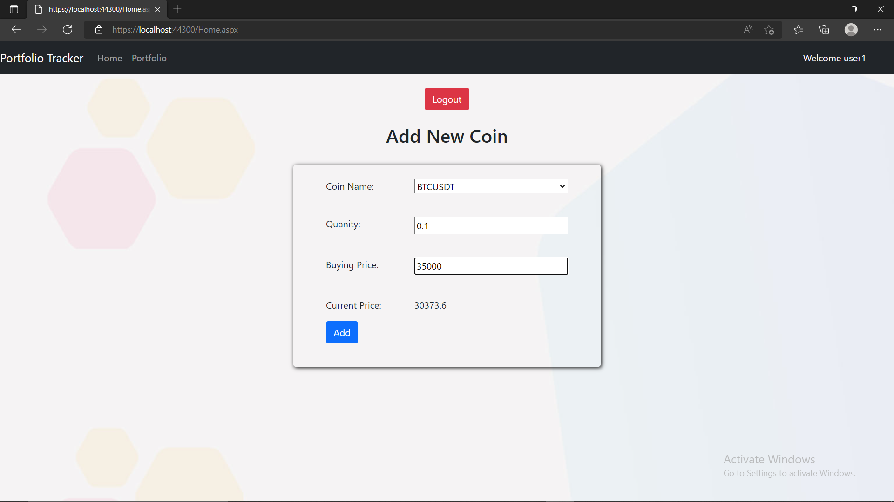
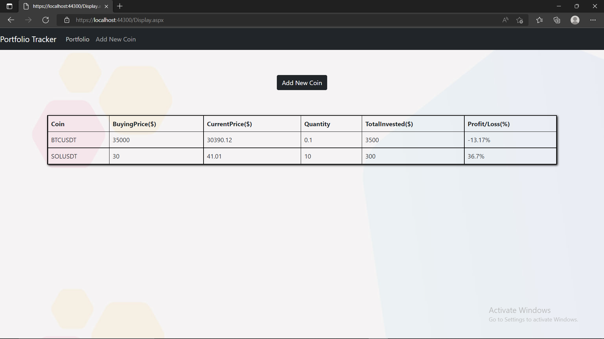

# Crypto Portfolio Tracker

Crypto Portfolio Tracker is website Design Using .NET framework, which will Track portfolio of crypto investor. 
Through this website user can see their profit/loss of their investment in cryptocurrency.

Add Coin : After LoggedIn User can add coin details.   
  

Portfolio Details: After LoggedIn User can see their portfolio details(Profit/Loss).   
  
